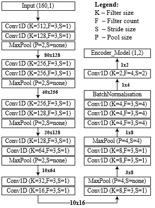
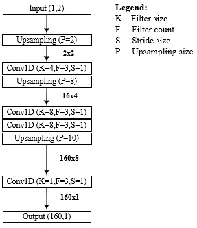

# AutoEncoder_ examples


There are two 1D CNN auto-encoders examples, they can be reconfigurable in both input and output according to your compression needs  

Example of CNN Auto-encoder_example01



The above figure depicts the architecture of the encoding part of the CNN auto-encoder used in our scheme. The encoder network takes speech samples as inputs, with a sampling rate of 8 kHz. The key feature of a CNN is the convolution layer that, in our case, consists of two one-dimensional convolution layers of filter sizes 3X3. These convolution layers are conveniently arranged in order to replicate 128X160 characteristic vectors. After that, a max-pooling layer is added to the second layer feature vectors in order to downsize the sample number to 128X80, while retaining the main features of the input data. The same principle is repeated for the next four groups, with different parameters such as filter size, filter count, stride size and pool size, until we obtain a matrix of size 16X10. 

Example of CNN Auto-decoder_example01



CNN-AutoDecoder expands the feature-map to its original format (polynomial coefficients) with negligible changes. The above figure illustrates the architecture of the decoding part of the CNN decoder used in our scheme. The design of the decoder structure can be very similar (symmetric) or dissimilar to the encoder architecture. The proposed CNN decoder consists of cascaded 1D up-sampling and 1D convolutional layers. The first 1D up-sample layer doubles the dimensions of the input feature 1X2 according to a given up-sampling size (P=2). Then, 1D convolution is applied using a transposed filter with three filters of sizes 4X4. The features are then up-sampled to eight times larger than its last size resulting in a feature of dimension 16X4. The latter output is then processed by two cascaded convolutions with three filters of sizes 8X8 each, and up-sampled again ten times. The final 1D convolution layer with three filters sized 1X1 results in the retrieved original signal (polynomial coefficients) with the original size of 160X1.  


**The Original (cover speech) and the output (stego speech after using SIAE) Databases are available in [KAGGLE](https://www.kaggle.com/hamzakheddar/SIAE-DB-Speech)**

Please cite the following paper if you find the database usefull in your new steganalysis or steganography research, or if you quote some parts of the research paper that fit your research you conduct. 

```
@article{kheddar2022high,
  title={High capacity speech steganography for the G723. 1 coder based on quantised line spectral pairs interpolation and CNN auto-encoding},
  author={Kheddar, Hamza and Meg{\'\i}as, David},
  journal={Applied Intelligence},
  pages={1--19},
  year={2022},
  publisher={Springer}
}

```

